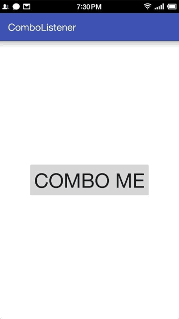

# ComboListener
Observe click combo on any view on Android.

##ScreenShot


##Usages

```java
public class MainActivity extends AppCompatActivity {
    @Override
    protected void onCreate(Bundle savedInstanceState) {
        super.onCreate(savedInstanceState);
        setContentView(R.layout.activity_main);
        
        final Toast toast = Toast.makeText(this, "", Toast.LENGTH_SHORT);
        Button btnCombo = (Button) findViewById(R.id.btn_combo);

        new ComboListenerBuilder()
                .setMaxInterval(500)//set the Max Interval between two clicks, default is 300ms
                .observeOn(btnCombo)//set the view to be observed
                .setOnComboListener(new ComboListenerBuilder.OnComboListener() {
                    @Override
                    public void onCombo(View view, int comboCount) {
                        toast.setText(comboCount+"");
                        toast.show();
                    }
                })
                .startListen();
    }
}
```